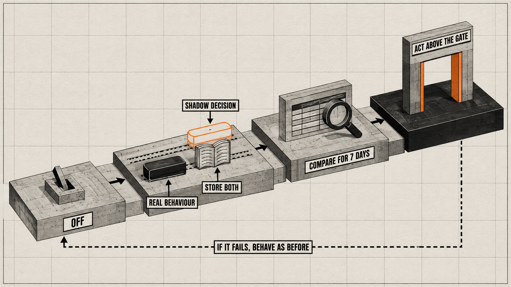
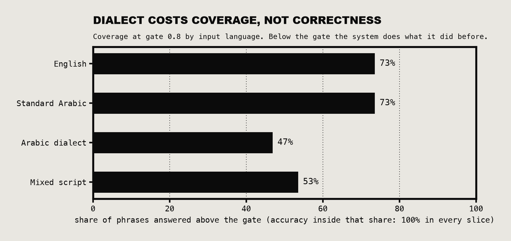
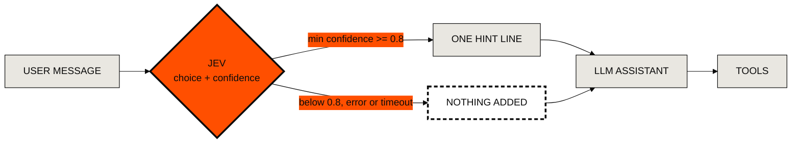
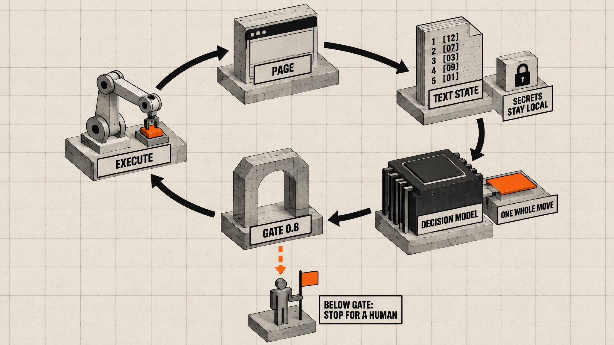
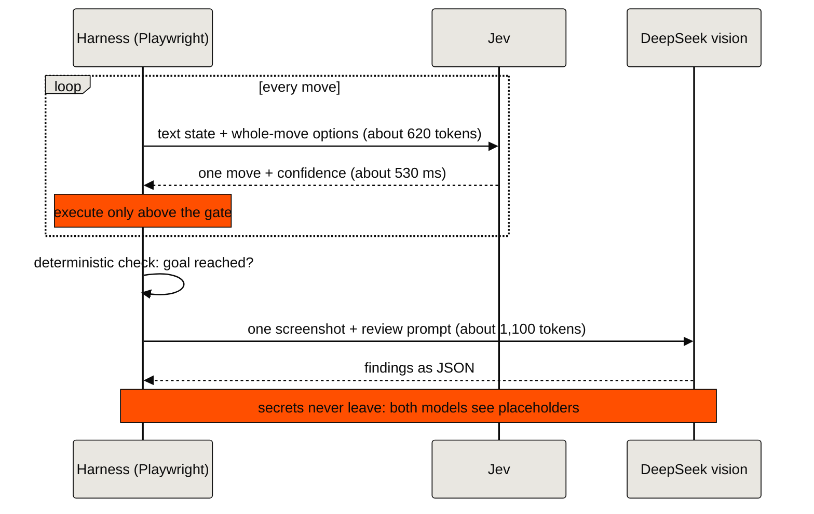
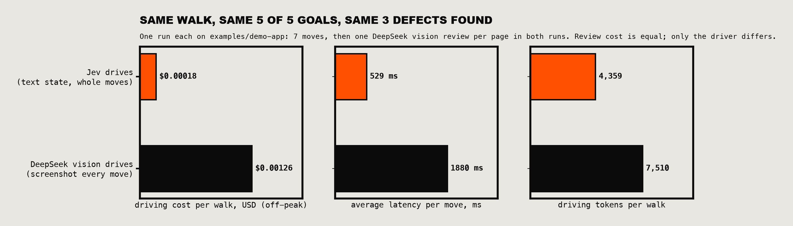
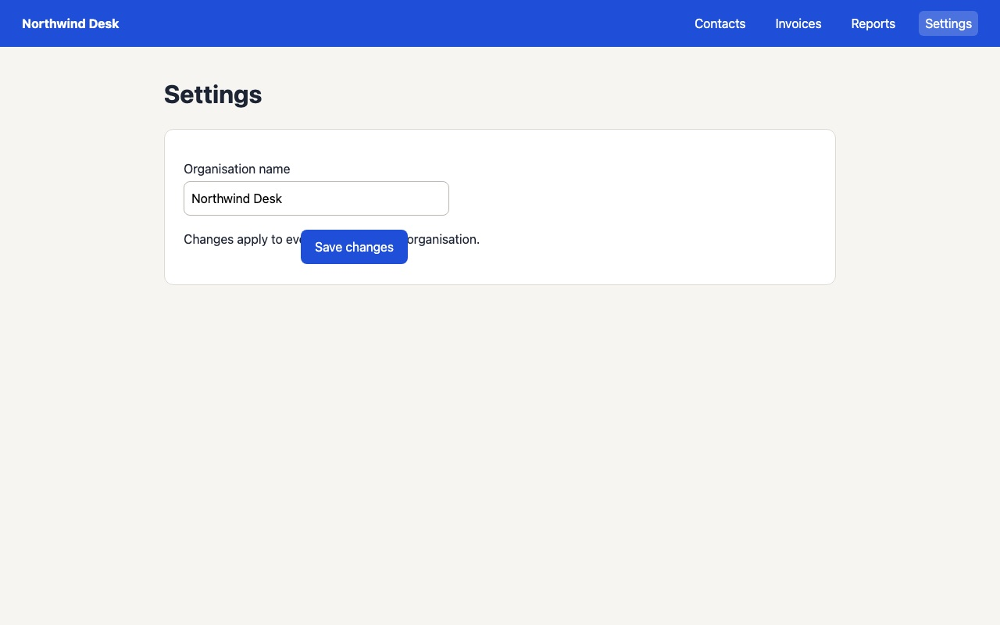
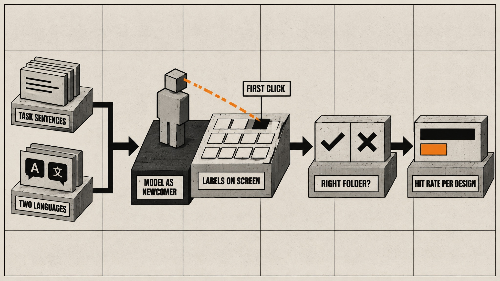
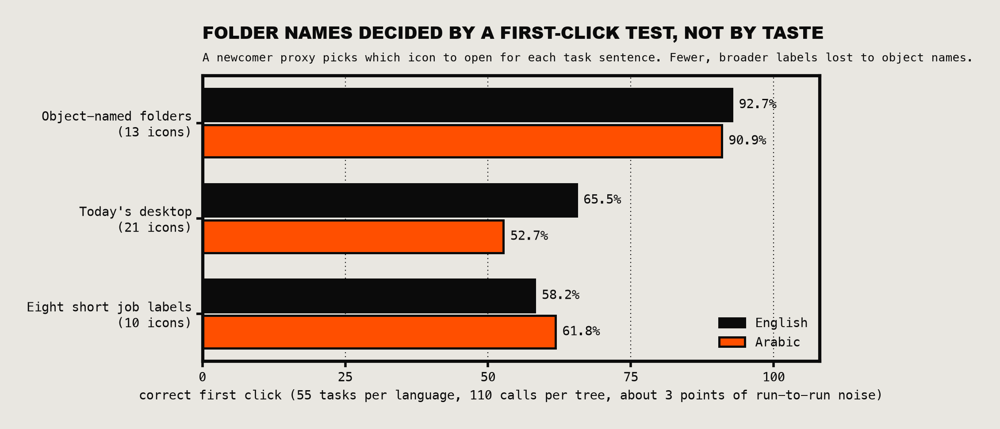

<p align="left">
  <a href="https://maykana.ly">
    <picture>
      <source media="(prefers-color-scheme: dark)" srcset="assets/maykana-logo-white.svg">
      
    </picture>
  </a>
</p>

# Jevaluate

**A free tool that lets a cheap AI test your web app like a person would, and stop to ask a human whenever it isn't sure.**

An open-source project by [Maykana](https://maykana.ly), shared for anyone building with AI.


## What it does, in plain words

1. **You write down what to check**, in normal sentences: "Log in", "Open the Invoices page".
2. **An AI clicks through your app.** It uses [TypeSafe's Jev](https://docs.typesafe.ai), a small model that never writes anything. It only picks the next step from a short list, like "click Invoices", and says how sure it is.
3. **If it is less than 80% sure, it does not click.** It stops and leaves a note for a person. That rule is the whole idea: the AI only acts when it is confident.
4. **On every page it takes one screenshot** and asks a second AI that can see (DeepSeek) to look for visual problems: text covering a button, text too faint to read, leftover code on screen.
5. **You get a short report** with what it found and what it cost.

On our demo app, where we hid 3 problems on purpose, it found all 3. The whole run cost less than one cent.

## Why trust the "how sure" number?

We tested it on 60 made-up requests in English, Arabic and mixed Arabic-English. It got 10 wrong. **All 10 times, it said it wasn't sure.** Every time it said it was sure, it was right.

60 is a small test, and your app is not our app. That is why the tool is built to be checked: run it on your own pages and see where it stops.

## Try it

You need Node 18 or newer, an API key from [TypeSafe](https://docs.typesafe.ai) and one from [DeepSeek](https://api-docs.deepseek.com).

```bash
git clone https://github.com/ElshinQ/jevaluate && cd jevaluate
npm init -y && npm i -D @playwright/test@1 && npx playwright install chromium
export TYPESAFE_API_KEY=...  DEEPSEEK_API_KEY=...
node scripts/walk.mjs --spec examples/walk-watch.json --watch
```

A browser opens and you watch it work. The report lands in `walk-run/walk-report.md`. To test your own app, copy `examples/walk.json` and change the address and the steps. Use a test copy of your app and throwaway logins: screenshots are sent to DeepSeek.

## What else is in here

The walk is the part most people will want. The repo also has the tools and notes behind it, for developers who want to use Jev elsewhere:

- a small client and a way to measure how accurate Jev is on your own examples
- a checker for text on screen that users should never see
- a test for whether menu labels make sense to a newcomer
- a skill file so AI coding agents (Claude Code and others) can use all of this
- the full write-up of how we tested it, mistakes included, in [`article/`](article/README.md)

Everything below is the technical detail.

---

## Five-minute start

Requires Node 18+ and Python 3.9+. The eval, the text judge and the tree test need no packages. The browser loop and the walk need Playwright, the walk also needs a DeepSeek API key, and the chart script needs matplotlib (see below).

```bash
git clone https://github.com/ElshinQ/jevaluate && cd jevaluate
mkdir -p ~/.config/typesafe && chmod 700 ~/.config/typesafe
# put TYPESAFE_API_KEY=... in ~/.config/typesafe/env, then: chmod 600 ~/.config/typesafe/env

python3 scripts/eval.py --questions examples/questions.json --cases examples/cases.json
node scripts/judge-lines.mjs examples/lines.txt English
node scripts/tree-test.mjs --tree examples/tree.json --tasks examples/tasks.json
```

Expected output from the first command:

```text
calls ok 4/4  input tokens 1649  est cost $0.00007  avg tokens/call 412
slice        n   all ok   gate>=0.8:  coverage  accuracy
ALL          4     100%                   100%      100%
wrong AND above the gate (fix criteria for these first): none
```

And from the second, on three lines of UI text:

```text
judged 3  errors 0  flagged 2  unsure 0
FLAG   untranslated_key c=0.96  crm.contacts.empty_title
FLAG   developer_artifact c=0.99  // TODO remove before release
```

`TYPESAFE_API_KEY` in the environment wins over the file. `TYPESAFE_ENV_FILE` points the scripts at a different file.

### Optional: the browser loop

```bash
npm init -y && npm i -D @playwright/test@1 && npx playwright install chromium
node scripts/browser-loop.mjs --url http://localhost:8000/login \
  --goal "Log in as owner@example.test with password 'password', then open the contacts page."
```

Point it at a scratch or staging instance with throwaway credentials. Values quoted in the goal stay on your machine: the model and the trace see placeholders such as `<v0>`. Everything else visible on the page is sent to the API and written to `jev-run/`, which is gitignored and created with owner-only permissions.

## Use it as an agent skill

The repository is laid out as a skill for Claude Code and compatible agents.

```bash
git clone https://github.com/ElshinQ/jevaluate ~/.claude/skills/jevaluate
```

The agent loads `SKILL.md` when a task mentions Jev, calibrated confidence, cheap classification, routing or triage, and reads the files under `references/` on demand.

## Read the story first

[The article](article/README.md) tells how this came about: four experiments, what broke, and the mistake a reviewer caught. The [launch thread](article/thread.md) is the short version.

## What is in the box

| Path | What it is |
| --- | --- |
| `SKILL.md` | When to use Jev, the five rules, the boundaries, the workflow for a new integration |
| `references/api.md` | Request and response shapes, errors, limits, price, measured latency |
| `references/question-design.md` | Writing questions that calibrate, multilingual notes, the known failure modes |
| `references/patterns.md` | Each use case: state layout, questions, what the code does, what went wrong |
| `references/integration.md` | `off`, `shadow` and `act` modes, fallback, stored record, the test list, rollout |
| `scripts/jev.mjs` | Zero-dependency client: key loading, backoff on 429 and 529, a small concurrency pool |
| `scripts/eval.py` | Labelled-case eval: accuracy, coverage at the gate and accuracy at the gate, per slice |
| `scripts/browser-loop.mjs` | Playwright loop driven by Jev that stops for a human below the gate |
| `scripts/walk.mjs` | Full product walk: Jev drives, DeepSeek vision reviews one screenshot per page, writes a report with costs. `--watch` shows and records it |
| `scripts/make-clip.sh` | Turns a recorded walk into an mp4 and a GIF |
| `scripts/judge-lines.mjs` | Classifies visible UI text: customer copy, developer artefact, raw key, wrong language |
| `scripts/tree-test.mjs` | First-click test for navigation labels across locales |
| `scripts/charts.py` | Redraws the charts on this page from `data/` |
| `data/routing-eval-rows.json` | The 60 synthetic routing phrases with the model's raw answers and confidences |
| `data/walk-demo/` | The two measured walk runs and the sample report |
| `examples/` | Tiny inputs so every script runs on a fresh clone, including a demo app with three planted defects |

## The five rules

1. **Calibration is the product, so gate on it.** Design for "act when confident, otherwise do today's thing". Never for "always obey".
2. **One complete statement per option.** Dependent decisions go into one question whose options are whole moves. Split them and the probability splits with them.
3. **Literal criteria, written for a stranger.** Jev answers what you wrote. When a wrong answer makes you say "but I meant", that sentence is the missing criterion.
4. **Small state, filtered in code.** Send what the question needs and nothing else. Include the values that matter.
5. **Shadow first.** Store the decision beside what really happened for a week, compare, then act above the gate.



## What we measured

### Routing a user message in front of an LLM assistant

Two choice questions on the user's message: which operation (12 options) and which record type (22 options). Above the gate the application adds one hint line to the assistant's system prompt. Tool declarations never change, so the prompt cache holds and a wrong hint cannot remove the right tool.

| Slice | Both correct | Coverage at 0.8 | Accuracy at 0.8 |
| --- | --- | --- | --- |
| English | 87% | 73% | 100% |
| Standard Arabic | 87% | 73% | 100% |
| Arabic dialect | 80% | 47% | 100% |
| Mixed script | 80% | 53% | 100% |
| All 60 | 83% | 62% | 100% |

About 1,650 input tokens per call with bilingual criteria, USD 0.004 for the whole run, p50 1,022 ms from a laptop on a cold connection and 610 to 690 ms from a European VPS.



Dialect and mixed-script input lowers how often Jev is sure. It does not make it confidently wrong.



The hint never restricts the assistant. It still sees every tool, so a wrong or missing hint costs nothing.

### Driving a browser

Each step the harness sends an indexed list of visible elements with their current values, and asks one question whose options are complete moves such as "Type X into element 2" or "Click element 7". It executes only above the gate.




It logged into an Arabic-rendered application unaided. Then it clicked an icon on a desktop-style shell that needed a double click, saw nothing change, and its confidence fell to 0.46. The loop stopped and wrote a trace. That stop is the behaviour you want from an unattended agent.

What did not work: asking `action`, `target` and `value` as three questions. The target came back split 0.55 against 0.42 and nothing cleared the gate. Merged into whole moves, the same page gave 1.00.


### Walking a whole product: Jev drives, DeepSeek vision looks

A QA walk has two jobs that want different models. Getting from page to page is a string of small closed decisions, which is what Jev is for. Judging whether a page looks right needs eyes. `scripts/walk.mjs` splits them: Jev drives on a text state, and `deepseek-flash` (DeepSeek's vision model) sees exactly one screenshot per page reached.


```mermaid
%%{init: {'theme':'base','themeVariables':{'primaryColor':'#e9e7e1','primaryTextColor':'#0b0b0b','primaryBorderColor':'#0b0b0b','lineColor':'#0b0b0b','secondaryColor':'#ff4f00','tertiaryColor':'#ffffff','fontFamily':'monospace','actorBkg':'#e9e7e1','actorBorder':'#0b0b0b','signalColor':'#0b0b0b','noteBkgColor':'#ff4f00','noteTextColor':'#0b0b0b','noteBorderColor':'#0b0b0b'}}}%%
flowchart LR
    G["GOALS<br/>walk.json"] --> S["TEXT STATE<br/>indexed elements"]
    S --> J{"JEV<br/>one whole move"}
    J -->|"confidence >= 0.8"| X["EXECUTE<br/>revalidated element"]
    J -->|"below gate"| H["STOP<br/>trace for a human"]
    X --> RREACHED?<br/>regex on title
    R -->|no| S
    R -->|yes| P["ONE SCREENSHOT"]
    P --> V{"DEEPSEEK VISION<br/>review the pixels"}
    V --> W["WALK REPORT<br/>findings + costs"]
    W -->|"next goal"| S
    style J fill:#ff4f00,stroke:#0b0b0b,stroke-width:3px
    style V fill:#0b0b0b,color:#e9e7e1,stroke:#0b0b0b,stroke-width:3px
    style H fill:#ffffff,stroke:#0b0b0b,stroke-width:3px,stroke-dasharray: 6 4
```

Who talks to whom, and what each call carries:



We ran the same five-goal walk twice on `examples/demo-app`, a small invented app with three planted visual defects. Once with Jev driving, once with DeepSeek vision driving from a screenshot at every move. The review step is identical in both.



| Same walk, 7 moves | Jev drives | DeepSeek vision drives | Difference |
|---|---|---|---|
| Goals reached | 5 of 5 | 5 of 5 | same |
| Planted defects found by the review | 3 of 3 | 3 of 3 | same |
| Driving cost, off-peak | $0.00018 | $0.00126 | 6.9x cheaper |
| Driving cost, peak | $0.00018 | $0.00253 | 13.8x cheaper |
| Latency per move | 529 ms | 1,880 ms | 3.6x faster |
| Driving tokens | 4,359 | 7,510 | 1.7x fewer |
| Wall time for the walk | 22 s | 33 s | a third less |
| Whole walk with reviews, off-peak | $0.00151 | $0.00254 | 40% less |
| Whole walk with reviews, peak | $0.00284 | $0.00508 | 44% less |

The three findings, as the vision model wrote them: a raw translation key shown as a heading (`invoices.empty_state.title`), a sentence in pale grey that is barely legible, and a Save button drawn on top of its help text. None of the three is visible in a text state, which is why the reviewer has to be a vision model. The full report is in [`data/walk-demo/walk-report.md`](data/walk-demo/walk-report.md).



Read the saving for what it is:

- **The speed figure varies a lot between runs.** Later Jev-driven runs averaged 850 to 1,450 ms per move, not 529 ms, so treat "3.6x faster" as one good run, not a promise. The cost difference held.

- **It is one run of each driver on a five-page demo.** Both walks cost a fraction of a cent. The ratio is what carries to scale: at these per-move costs, 1,000 moves is about $0.03 with Jev and about $0.18 to $0.36 with vision driving. That line is arithmetic, not a measurement.
- **The review is now most of the bill** (88% of the Jev-driven walk). The driver saving grows with moves per page; this walk averaged 1.4. A form-heavy flow with ten moves per page moves the whole-walk saving towards the driving ratio.
- **`deepseek-flash` is already one of the cheapest vision models.** We did not measure any other vision model, so we make no claim about them.
- **Vision review can miss things and can invent them.** Here it found three of three and invented none, on one run. Treat every finding as a lead to confirm on the screenshot.
- **Jev cannot do the review and the vision model should not do the driving.** Each model is used only for the thing it is measurably good at.

```bash
export DEEPSEEK_API_KEY=...   # or put it in ~/.config/deepseek/env
node scripts/walk.mjs --spec examples/walk.json                  # Jev drives
node scripts/walk.mjs --spec examples/walk.json --driver vision  # the baseline
```

Screenshots go to the DeepSeek API, so walk scratch or staging instances only.

### Watch it work

Add `--watch` and the walk runs in a visible browser, slowed down, with a panel showing the goal, the chosen move, the confidence against the gate and the state (THINKING, ACTING, REVIEWING, STOPPED). The element about to be touched gets an orange outline first. The run is recorded.


The recorded demo uses `examples/walk-watch.json`: the same five goals plus a sixth, "Open the Billing page", which the demo app does not have. Jev's best guess was Invoices at 0.50 (0.42 on another run), so it stopped instead of clicking. That stop is the point of the gate.

```bash
node scripts/walk.mjs --spec examples/walk-watch.json --watch --out walk-run/watch
sh scripts/make-clip.sh walk-run/watch/walk.webm      # walk.mp4 for social, walk.gif for a README (needs ffmpeg)
```

The panel is kept out of the text state Jev reads and hidden from every screenshot the vision model reviews, so watching does not change what the models see. The video does show whatever is typed into non-password fields: throwaway credentials only.

### Deciding navigation labels with a first-click test

One realistic task sentence per destination, in each language, against the labels on screen. Jev plays a newcomer and picks what to open first.





The winning tree shipped. The first version of this measurement was wrong: it counted screens that are not on the desktop at all, and an independent reviewer caught it. The figures above are the re-measured ones. Treat the method as a cheap filter before a study with five real people, not as a replacement for one.

### Judging visible UI text

One call per visible line, four classes. It runs beside a regex check during QA walks and catches the leaks nobody wrote a regex for yet: a stray source comment, a raw translation key, an English string on an Arabic screen.

### Designed, not yet measured

CI failure triage, a completeness pre-check before an expensive grader, finding dedupe in bug hunts, and candidate scoring in research loops. The shapes are in `references/patterns.md` and are labelled as designs. No numbers are claimed for them.

## Boundaries we keep

- If Jev is down, slow, malformed or rate limited, the system behaves exactly as it did before Jev existed. Inline timeout 1,200 ms, no retries inline.
- Know exactly what leaves your system. Everything in `state` goes to a third-party API. We send one of three things: the single message the user just typed, interface text that any visitor can see, or synthetic test constants. We never attach ids, history, records or stored customer data. A user's own message can still contain a name or an invoice number, so treat that route as personal data: get the agreement you need, or redact before sending.
- Never the final grade of anyone's work. It can front-run an independent grader, not replace one.
- Never in a financial or irreversible path. It names a category. It never supplies amounts, ids, dates or filters.
- Pin the version id. Aliases such as `jev-latest` move, and thresholds are tuned per version. Log the `model` field of every response.
- Keys live in the environment or a chmod 600 file outside the repository. Never on a command line.
- State is untrusted input. Text that argues for its own classification can move the answer.

## Where it fails

Counting, arithmetic, date comparison, multi-hop reasoning, large noisy state and anything that needs generated text. `references/question-design.md` has the workaround for each, mostly "do that part in code and hand Jev a named bucket".

## Reproducing the charts

`python3 scripts/charts.py` redraws all five charts into `assets/`. The calibration and coverage charts come straight from `data/routing-eval-rows.json`, which holds the 60 synthetic phrases with the raw answers (place and company names in the phrases were masked as `[city]` and `[company]` after the run; the recorded answers are untouched), so you can recompute every routing figure on this page. The walk chart comes from `data/walk-demo/`. The browser-loop and tree-test charts are drawn from summary figures written in the script, because their raw traces contain page text from a private application. Your own runs write the same shapes to `results/` and `jev-run/trace.jsonl`. About 3 points of run-to-run noise is normal, so differences under 5 points are not findings.

## Contributing

Failure modes and counter-examples are the most useful contribution. Open an issue with the question you asked, a synthetic state that reproduces it, the model id that answered and what you expected. Do not paste real user data or keys.

## Authorship

Jevaluate is a Maykana open-source project. Co-authored by Noor Elshin and Claude Fable 5.1 (Anthropic), working together in Claude Code. Noor ran the experiments in his own product, made the calls and owns the conclusions. Fable wrote most of the scripts, reference notes, charts and this README, fact-checked the API details against the live TypeSafe docs, and generated the illustrations. A separate model reviewed the code before release.

## Status and disclaimer

The diagrams were generated with an image model, then checked label by label; they contain no real data and only figures that were measured. Charts are drawn from the raw result files.

Independent notes. Not affiliated with or endorsed by TypeSafe. Measured on `jev-1.13.0`, 2026-09-17 to 2026-09-19.

## Licence

MIT. See `LICENSE`.
