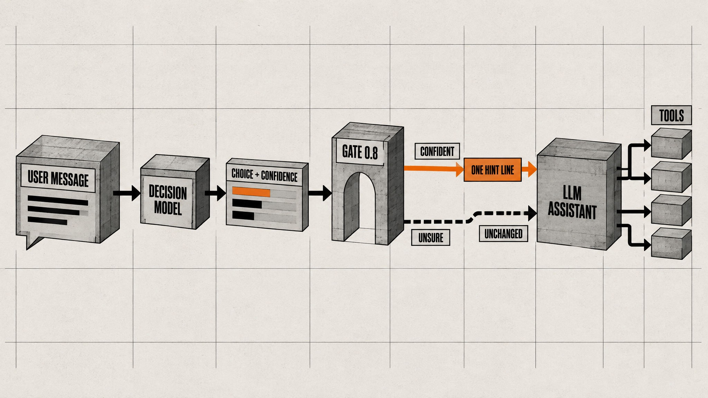
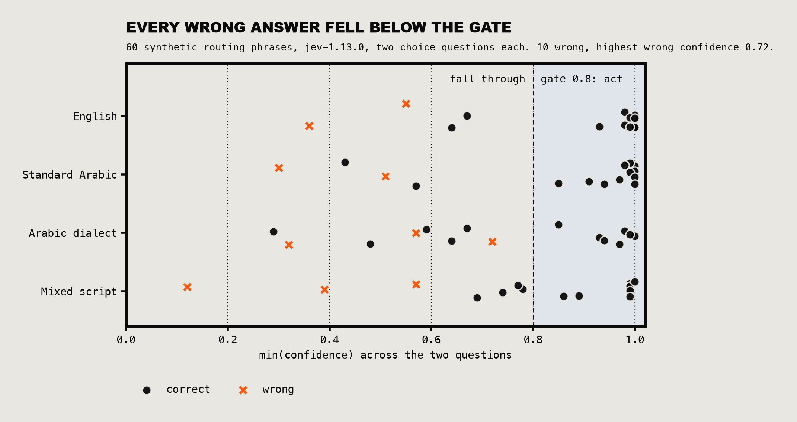
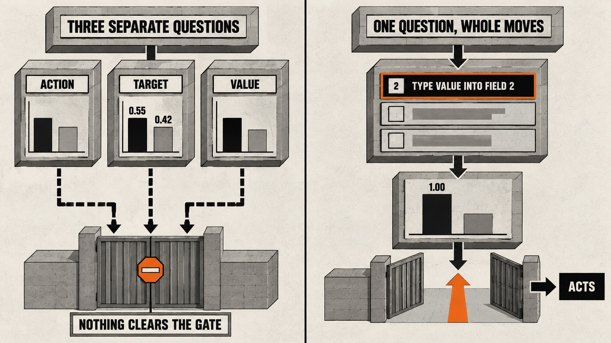
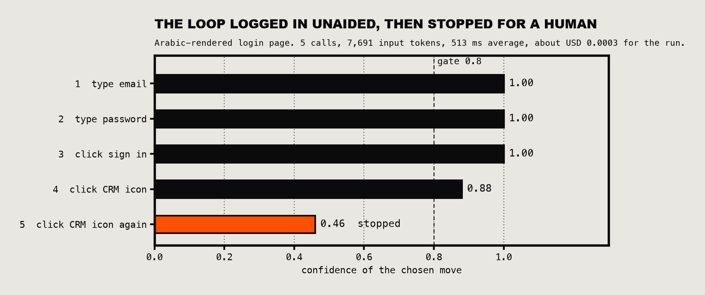
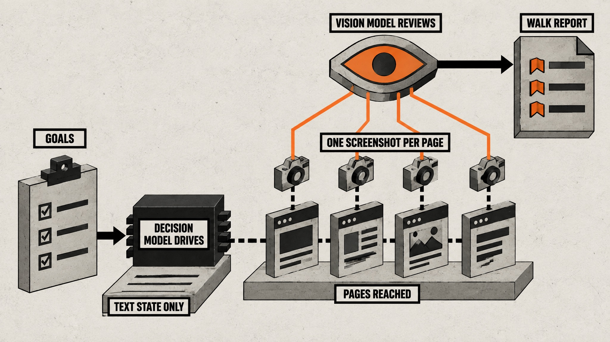

# I gave a model that cannot write a job in my build pipeline. Here is what four days of measurements showed.

*By Noor Elshin at Maykana, co-authored with Claude Fable 5.1 (Anthropic). The experiments ran in my product and the conclusions are mine. Fable wrote most of the code, drew the charts from the raw result files, generated the illustrations and drafted this piece with me.*

*Every number comes from a result file. The routing rows and the chart script are in this repository under `data/` and `scripts/`.*

On 17 September 2026 I ran 60 made-up sentences through TypeSafe's Jev model. English, Standard Arabic, a spoken Arabic dialect, and the mixed Arabic-in-Latin-letters style my users actually type. It got 10 of them wrong.

I still decided to build on it, because of where those 10 sat. Each wrong answer came back with a confidence below 0.8. The highest was 0.72. Every answer at 0.8 or above was correct.

Sixty phrases is a small sample, and 37 correct answers above the gate with no errors still leaves room for a true error rate of up to about 8%. It is a reason to keep measuring, not a guarantee. But it is the property that changes what you can build. This is the write-up of what I built on it, what broke, and the open-source kit that came out of it.

## What Jev is, in one paragraph

Jev is a decision model. You send text plus a closed list of options, and it returns one option with a probability for each and a calibrated confidence. It answers in 200 to 500 ms on a warm connection and costs USD 0.042 per million input tokens, with output free. My 60-phrase eval cost four tenths of a cent. It does not write text, it cannot count or compare dates, and it never sees a screenshot. People who expect a small chatbot will be disappointed. I treat it as a very fast, very cheap, honest `switch` statement.

## The problem I had

I build an Arabic-first business application. It has an AI assistant with a long list of tools, and it kept choosing the wrong one. A user asked in Arabic how many quotations they had and got a count of deals. Stock questions never reached the stock tool. In one seven-day census the mail, files and stock tools had zero calls between them.

My fixes were keyword rules applied after the model had already answered. Every new phrasing needed a new rule, and spoken dialect has a lot of phrasings.

## Experiment one: a routing hint

I wrote two questions about the user's message. What operation do they want, from 12 options. What record type is it about, from 22. Each option got a full sentence in English and Arabic, not a label.

| Input | Both right | Answered above 0.8 | Right above 0.8 |
| --- | --- | --- | --- |
| English | 87% | 73% | 100% |
| Standard Arabic | 87% | 73% | 100% |
| Arabic dialect | 80% | 47% | 100% |
| Mixed script | 80% | 53% | 100% |

Read the dialect row carefully. Jev was sure of itself less often on dialect. It was not wrong more often when it was sure. That is the behaviour I want from anything sitting in front of my users: when it does not know, it says so, and my code does what it did before.

So the integration is small on purpose. Above the gate, the app adds one line to the assistant's system prompt: the user most likely wants this operation on this record type, ignore it if it does not fit. The tool list never changes, so the prompt cache still hits and a bad hint cannot hide the right tool. It names a category and never an amount, an id or a date. It goes out in shadow mode first, storing its guess next to what the assistant really did, and I decide after a week of data.

Two of my early errors were my fault. "Stock counts" meant physical count sessions in my head and current quantities in the model's reading. And I had forgotten to offer "letters" as an option, so letter requests landed in "documents". Jev answers the question you wrote. Fixing two sentences of criteria moved accuracy more than anything else I tried.

## Experiment two: let it drive a browser

This one I did not expect to work.

A Playwright script captures the visible interactive elements of a page as a numbered text list. Jev gets that list and the goal, and picks the next move. The script only executes the move if confidence clears 0.8. The published version also keeps the email and password on my machine: the model sees placeholders, and so does the trace. A second model caught that gap in review before release.

My first design asked three questions: which action, which element, which value. It was useless. The target element came back split 0.55 against 0.42 and nothing cleared the gate.

Then I merged them into one question whose options are whole moves: "Type owner@acme.test into element 2", "Click element 7". Same page, same model. Confidence went to 1.00.

It typed the email, typed the password, pressed sign in, and landed on the desktop. Five calls, 7,691 input tokens, 513 ms average per decision, about three hundredths of a cent for the run.

Then it clicked the CRM icon. My desktop shell opens folders on a double click, so nothing happened. On the next step Jev looked at an unchanged page, saw it had already tried that click, and its confidence fell to 0.46. The loop stopped and wrote a trace for a human.

An unattended agent that knows when it is lost is rare. The stop is worth more to me than the login.

One more lesson from that run: the first version sent element names without their current values, and the model kept refilling a field that was already filled. The state has to contain what a person would see.

## Experiment three: naming folders without an argument

We were redesigning the desktop of the app, and two AI agents disagreed about folder names. One wanted a desktop of thirteen icons named after objects: Customers, Purchasing, Assets. The other wanted eight short job labels: Sell, Buy, Stock, Money, Govern.

Normally this becomes a taste debate. Instead I wrote one realistic task sentence for each of the 55 screens, in English and Arabic, and asked Jev the classic first-click question: a newcomer wants to do this, these are the labels on screen, which one do they open first? That is 110 calls per design, pennies per run.

Object names won by about 30 points in both languages. The eight short labels scored below the desktop we already had in English. Short is not the same as clear. "Govern" tells a newcomer nothing, "Assets" tells them what is inside.

My first version of this test was wrong. It counted seven screens that are not desktop icons at all, both as targets and as distractors. An independent code reviewer caught it, I re-measured, and the numbers above are the corrected ones. The conclusion held and the gap got wider. But I would have published the wrong table.

It is also a proxy. Jev stands in for a newcomer, it is not a user. Identical runs differ by about 3 points, so I ignore any gap under 5. Five real people on the same tasks is still the confirmation step.

## Experiment four: a judge for text nobody should see

During QA walks I collect every visible line of text in a panel and ask Jev what each one is: normal customer copy, a developer artefact, a raw translation key, or the wrong language for this screen. A regex already catches the leaks I know about. This catches the ones I have not met yet. On a three-line test it flagged `crm.contacts.empty_title` at 0.96 and `// TODO remove before release` at 0.99, and left "Save changes" alone.

## Experiment five: a full walk, with a vision model that only looks

The browser loop has a blind spot. Jev reads a text state, so it cannot see a button drawn on top of a sentence. A vision model can, but a vision model driving every click is slow and it is the expensive way to choose between six links.

So I split the job. Jev drives. When a page is reached, one screenshot goes to DeepSeek's vision model (`deepseek-flash`), which reports only what it can see in the pixels.

I built a small invented app with three planted defects and ran the same five-goal walk twice: once with Jev driving, once with DeepSeek vision driving from a screenshot at every move. The review step was identical.

| 7 moves, 5 pages | Jev drives | Vision drives |
|---|---|---|
| Goals reached | 5 of 5 | 5 of 5 |
| Planted defects found | 3 of 3 | 3 of 3 |
| Driving cost (off-peak) | $0.00018 | $0.00126 |
| Latency per move | 529 ms | 1,880 ms |
| Whole walk with reviews | $0.00151 | $0.00254 |

Driving was 6.9 times cheaper off-peak, 13.8 times at peak prices, and 3.6 times faster. The whole walk cost 40% less.

Now the honest part. It is one run of each on a five-page demo, and both walks cost a fraction of a cent. The review is 88% of the Jev-driven bill, so the saving depends on how many moves you make per page; this walk averaged 1.4. And DeepSeek's model is already one of the cheapest vision models there is. I did not measure any other.

The reviewer found all three defects and invented none: a raw key shown as a heading, a pale grey sentence nobody could read, and a Save button covering its own help text. On one run. I still confirm every finding on the screenshot.

## Where I will not use it

- Anywhere near money. It never sees an amount and never approves anything.
- As the final grade of anyone's work. It can tell me a report does not mention evidence for line 3 before I spend an expensive grader on it. It cannot check the evidence.
- With stored customer data in the payload. What leaves my system is one of three things: the message the user just typed, interface text any visitor can see, or synthetic test constants. No ids, no history, no records. A user's own message can still carry a name, so I treat that route as personal data.
- Without a fallback. If Jev is down, slow or returns rubbish, the system behaves exactly as it did the day before I integrated it. The inline timeout is 1,200 ms with no retries.

TypeSafe publishes its own list of what the model is bad at, and it matches what I saw: counting, arithmetic, comparing dates, anything with two hops of reasoning, and big noisy inputs. The fix is the same each time. Do that part in code and hand Jev a named bucket.

## The five rules I would give someone starting today

1. Gate on confidence. Design for "act when sure, otherwise do today's thing".
2. One complete statement per option. If decisions depend on each other, merge them into one question.
3. Write criteria for a stranger. When a wrong answer makes you say "but I meant", that sentence is the missing criterion.
4. Keep the state small and filter it in code. Include the values a person would see.
5. Shadow first. Store the decision beside reality for a week, then act.

## The kit

I packaged all of this as an open-source repository that also works as a skill for coding agents: the client, the eval harness, the browser loop, the text judge, the tree test, tiny examples so everything runs on a fresh clone, and reference notes on the API, question design and rollout. Four of the eight patterns in it are designs I have not measured yet, and they are labelled that way.

https://github.com/ElshinQ/jevaluate

It is pinned to `jev-1.13.0`. When the next version ships I will re-run the evals and update the numbers, and I would like to see yours. Failure cases most of all.
